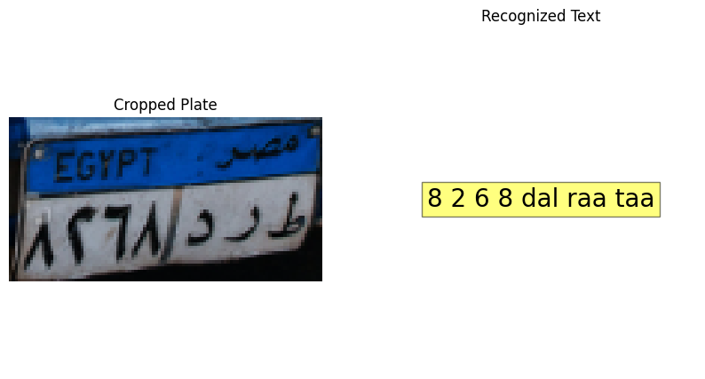

# 🚗 Egyptian License Plate Recognition System (YOLO11)

An advanced **Automatic License Plate Recognition (ALPR)** pipeline tailored for **Egyptian Vehicles**. This project utilizes a multi-stage Deep Learning approach to detect vehicles, localize license plates, and recognize Arabic alphanumeric characters with high accuracy.


*(Example of the detection and recognition pipeline)*

---

## ✨ Key Features

* **⚡ Double YOLO11 Architecture:**
    * **Model 1:** Detects License Plates (and Vehicles).
    * **Model 2:** Recognizes Arabic Characters & Numbers (OCR).
* **🇪🇬 Arabic OCR Support:** Custom logic to map and order Arabic letters (e.g., `أ`, `ب`, `ج`) and numbers correctly from right to left.
* **🔍 Advanced Pre-processing:** Implements **Image Super-Resolution** and **Adaptive Thresholding** to handle low-resolution or blurry plates.
* **🧠 Logic & Voting:** Includes a post-processing algorithm to sort characters spatially (X-axis) and filter noise for cleaner output.

---

## 📂 Project Structure

```text
Egyptian-License-Plate-Recognition/
├── checkpoints/         # Trained YOLO11 models (.pt files)
│   ├── best_plate.pt    # Plate Detector
│   └── best_char.pt     # Character Recognizer
├── inference.py         # Main script to run the recognition
├── utils.py             # Helper functions (Arabic mapping, visualization)
├── requirements.txt     # Python dependencies
└── README.md            # Project documentation

### 2. Video Inference (Tracking & Voting)
To process a video file and generate a CSV report with the best license plate for each vehicle (using tracking and majority voting):

1.  Place your video in the `data/` folder.
2.  Run the video script:
```bash
python video_inference.py